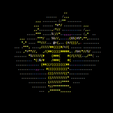

<div align='center'>

</div>

<br>

<p>
  Electron React Boilerplate uses <a href="https://electron.atom.io/">Electron</a>, <a href="https://facebook.github.io/react/">React</a>, <a href="https://github.com/reactjs/react-router">React Router</a>, <a href="https://webpack.js.org/">Webpack</a> and <a href="https://www.npmjs.com/package/react-refresh">React Fast Refresh</a>. The same can be said for Rat-ide<br>
  additional technology:  <a href="https://mui.com/">react MUI</a>, <a href="https://ace.c9.io/">AceEditor</a>, <a href="https://github.com/securingsincity/react-ace">ReactAce</a>
</p>

<br>


## Install

Clone the repo and install dependencies:

step ONE:

```bash
git clone --branch master https://github.com/GithubAdamKiss/rat-ide.git
cd rat-ide
npm install
```
if said install crashes with requiment for visual studio c dependencies please uninstall node-pty package and then install again:

```bash
npm uninstall node-pty
npm install
```
step TWO: <br>
  u need to copy two aditional files into [node_modules/ace-builds/src-noconflict](./node_modules/ace-builds/src-noconflict/)

  first: [theme-rat](./node_modules/ace-builds/src-noconflict/theme-rat.js) the custom  <a href="https://ace.c9.io/">AceEditor</a> theme 

  second: [ace-builds-modules](./node_modules/ace-builds/ace-modules.d.ts) the theme decleration
   
## Starting rat-ide

Start the app in the `dev` environment:

```bash
npm start
```

## Keyboard Shortcuts:
Line operations:

| Command Name        	| win/linux            	| mac                                     	|   	|   	|
|---------------------	|----------------	|-----------------------------------------	|---	|---	|
| Remove line         	| Ctrl-D         	| Command-D                               	|   	|   	|
| Copy lines down     	| Alt-Shift-Down 	| Command-Option-Down                     	|   	|   	|
| Copy lines up       	| Alt-Shift-Up   	| Command-Option-Up                       	|   	|   	|
| Move lines down     	| Alt-Down       	| Option-Down                             	|   	|   	|
| Move lines up       	| Alt-Up         	| Option-Up                               	|   	|   	|
| Remove to line end  	| Alt-Delete     	| Ctrl-K                                  	|   	|   	|
| Remove to linestart 	| Alt-Backspace  	| Command-Backspace                       	|   	|   	|
| Remove word left    	| Ctrl-Backspace 	| Option-Backspace, Ctrl-Option-Backspace 	|   	|   	|
| Remove word right   	| Ctrl-Delete    	| Option-Delete                           	|   	|   	|
| Split line          	| ---            	| Ctrl-O                                  	|   	|   	|


<br>
Selection:

| Command Name               	| win/linux        	| mac                 	|   	|   	|
|----------------------------	|------------------	|---------------------	|---	|---	|
| Select all                 	| Ctrl-A           	| Command-A           	|   	|   	|
| Select left                	| Shift-Left       	| Shift-Left          	|   	|   	|
| Select right               	| Shift-Right      	| Shift-Right         	|   	|   	|
| Select word left           	| Ctrl-Shift-Left  	| Option-Shift-Left   	|   	|   	|
| Select word right          	| Ctrl-Shift-Right 	| Option-Shift-Right  	|   	|   	|
| Select line start          	| Shift-Home       	| Shift-Home          	|   	|   	|
| Select line end            	| Shift-End        	| Shift-End           	|   	|   	|
| Select to line end         	| Alt-Shift-Right  	| Command-Shift-Right 	|   	|   	|
| Select to line start       	| Alt-Shift-Left   	| Command-Shift-Left  	|   	|   	|
| Select up                  	| Shift-Up         	| Shift-Up            	|   	|   	|
| Select down                	| Shift-Down       	| Shift-Down          	|   	|   	|
| Select page up             	| Shift-PageUp     	| Shift-PageUp        	|   	|   	|
| Select page down           	| Shift-PageDown   	| Shift-PageDown      	|   	|   	|
| Select to start            	| Ctrl-Shift-Home  	| Command-Shift-Up    	|   	|   	|
| Select to end              	| Ctrl-Shift-End   	| Command-Shift-Down  	|   	|   	|
| Duplicate selection        	| Ctrl-Shift-D     	| Command-Shift-D     	|   	|   	|
| Select to matching bracket 	| Ctrl-Shift-P     	| ---                 	|   	|   	|

<br>
Go to:

| Command Name           	| win/linux      	| mac                        	|   	|   	|
|------------------------	|----------------	|----------------------------	|---	|---	|
| Go to left             	| Left           	| Left, Ctrl-B               	|   	|   	|
| Go to right            	| Right          	| Right, Ctrl-F              	|   	|   	|
| Go to word left        	| Ctrl-Left      	| Option-Left                	|   	|   	|
| Go to word right       	| Ctrl-Right     	| Option-Right               	|   	|   	|
| Go line up             	| Up             	| Up, Ctrl-P                 	|   	|   	|
| Go line down           	| Down           	| Down, Ctrl-N               	|   	|   	|
| Go to line start       	| Alt-Left, Home 	| Command-Left, Home, Ctrl-A 	|   	|   	|
| Go to line end         	| Alt-Right, End 	| Command-Right, End, Ctrl-E 	|   	|   	|
| Go to page up          	| PageUp         	| Option-PageUp              	|   	|   	|
| Go to page down        	| PageDown       	| Option-PageDown, Ctrl-V    	|   	|   	|
| Go to start            	| Ctrl-Home      	| Command-Home, Command-Up   	|   	|   	|
| Go to end              	| Ctrl-End       	| Command-End, Command-Down  	|   	|   	|
| Go to line             	| Ctrl-L         	| Command-L                  	|   	|   	|
| Scroll line down       	| Ctrl-Down      	| Command-Down               	|   	|   	|
| Scroll line up         	| Ctrl-Up        	| ---                        	|   	|   	|
| Go to matching bracket 	| Ctrl-P         	| ---                        	|   	|   	|
| Scroll page down       	| ---            	| Option-PageDown            	|   	|   	|
| Scroll page up         	| ---            	| Option-PageUp              	|   	|   	|

<br>
Find/Replace:

| Command Name  	| win/linux    	| mac              	|   	|   	|
|---------------	|--------------	|------------------	|---	|---	|
| Find          	| Ctrl-F       	| Command-F        	|   	|   	|
| Replace       	| Ctrl-H       	| Command-Option-F 	|   	|   	|
| Find next     	| Ctrl-K       	| Command-G        	|   	|   	|
| Find previous 	| Ctrl-Shift-K 	| Command-Shift-G  	|   	|   	|


## License

MIT © [Electron React Boilerplate](https://github.com/electron-react-boilerplate)


